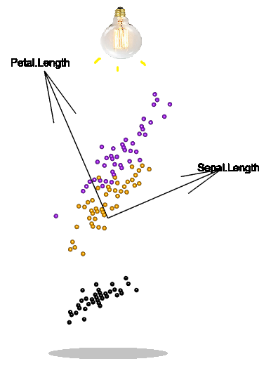

```{r setup, include=FALSE}
knitr::opts_chunk$set(echo = TRUE)
options(rgl.useNULL=TRUE)
library(rgl)
knitr::knit_hooks$set(webgl = hook_webgl)
```

## Introduction

As biologists, we often find ourselves with many measurements of the same things. These "things" might be plants or people or study sites or blood samples or anything else you might study. We refer to each measurement as a "dimension". While it's great to have so much information about the things you're studying, having a large number of dimensions poses challenges for statistical analysis. One challenge is that some of the measurements will likely be strongly correlated with each other because they're measuring related properties. Correlated variables provide redundant information and violate the assumptions of some models (e.g., multiple regression). Another challenge is that number of dimensions that can be displayed on one graph is limited, so it can be difficult to visualize all the variables together. 

Principal Component Analysis (PCA) is a powerful tool for finding patterns in data with many dimensions. PCA allows you to describe your data with new variables (called principal components) that better express the similarities and differences between the things you're measuring. A common use of PCA is to choose just a few of these new variables and discard the rest. This allows you to reduce the number of dimensions in your data without losing much information.   

This tutorial has two sections: Introduction and Assignment. In the Introduction section, I introduce the method of PCA using a case study of iris flowers. In the Assignment section, I give instructions for your assignment. Your assignment will give you the opportunity to interpret a PCA reported by other researchers and to perform and report your own PCA. 

***Learning objectives: *** By the end of this tutorial, you will be able to:

* Describe the principles, relating to variance and rotations, that underly principal component analysis.
* Interpret principal component analyses reported by other researchers.
* Perform principal component analysis using R, including visualizing and interpreting results.


### Iris case study 

In 1936, statistician Ronald Fisher published a paper with iris flower morphology measurements. He measured 50 flowers from three iris species. The measurements were petal length, petal width, sepal length, and sepal width, and the iris species were *Iris setosa*, *versicolor*, and *virginica*. 


<br>
*Photo of *Iris versicolor *flower. Image source: https://en.wikipedia.org/wiki/Iris_flower_data_set#/media/File:Iris_versicolor_3.jpg*

We can look at the first few rows of the *iris* dataset by using the *head* function in R. The measurements are given in centimeters. 

```{r iris}
head(iris)
```

The *summary* and *plot* functions allow us to further inspect the data.

```{r iris2}
summary(iris)
plot(iris[,1:4]) 
```

The *iris* dataset is a good candidate for PCA because it has multiple dimensions and the variables are correlated with each other. In the following subsections, we will use PCA to identify patterns in flower morphology.  


### Understanding PCA visually

PCA can be understood as a rotation of the data. The data is rotated in such a way that it varies as much as possible on the horizonal axis. The horizontal axis is the first principal component (PC1), and the vertical axis is the second principal component (PC2). 

Try rotating the scatterplot below. The origin of the axes is in the middle of the scatterplot because I standardized both variables to have means of 0 and variances of 1. Each point represents the sepal length and petal length measurements of one flower. **Rotate the scatterplot so that the data is as spread out as possible on the horizonal axis**. In other words, rotate the scatterplot so that the data has maximum variance on the PC1 axis. 

<details>
  <summary>Click for Hint</summary>
  One way to visualize the problem is to imagine a light source above the plot. How can you rotate the plot so that the points cast the widest possible shadow below the plot? The shadow is a projection of the data and the width of the shadow increases as the variance of the data on the horizonal axis increases. 
  <br>
  
</details>
<br>

```{r 2d, echo=FALSE}
colour = ifelse(iris$Species=="setosa", "black", ifelse(iris$Species=="versicolor","orange", "purple"))
iris_scale = data.frame(sapply(iris[,1:4],scale),iris$Species)
par3d(mouseMode=c("zAxis","none","none","none"))
view3d(theta=0, phi = 0, zoom=1, fov = 0)
plotids <- with(iris_scale, plot3d(Sepal.Length, Petal.Length, rep(0,150),xlab="",ylab="",zlab="",
                                   type="s", radius = 0.04, box=F, axes = F, col=colour))
arrow3d(p0 = c(0,0,0), p1 = c(0,3,0),type="lines")
text3d(0,3.2,0,"Petal.Length")
arrow3d(p0 = c(0,0,0), p1 = c(3,0,0),type="lines")
text3d(3.2,0,0,"Sepal.Length")
rglwidget(elementId = "plot3drgl")
```

Compare your solution to the PCA biplot below. Did you find the same solution? (Notice that if you rotate the scatter plot 180 degrees it will have the same variance on the horizonal axis. Therefore, if your solution is rotated 180 degrees from the PCA then this is an equally valid solution.)

```{r pca 2d, echo=FALSE}
colour = ifelse(iris$Species=="setosa", "black", ifelse(iris$Species=="versicolor","orange", "purple"))
data.pca <- prcomp(iris[,c(1,3)],scale=T)
par(mar=c(5,4,0,2))
plot(data.pca$x[,1],data.pca$x[,2],pch=19,col=colour,xlab="PC1",ylab="PC2",asp=1)
arrows(0,0,data.pca$rotation[1,1]*1.5,data.pca$rotation[1,2]*1.5)
text(data.pca$rotation[1,1]*1.5+0.5,data.pca$rotation[1,2]*1.5,"Sepal.Length")
arrows(0,0,data.pca$rotation[2,1]*1.5,data.pca$rotation[2,2]*1.5)
text(data.pca$rotation[2,1]*1.5+0.5,data.pca$rotation[2,2]*1.5,"Petal.Length")
legend("topright",legend = unique(iris$Species), fill=unique(colour))
```

The PCA becomes more interesting as we add a third dimension. As before, rotate the scatterplot below so that the data has the most variance on the horizontal axis. Then, rotate the scatterplot on its horizontal axis so that the data has the second-most variance on the vertical axis.  

```{r 3d, echo=FALSE}
colour = ifelse(iris$Species=="setosa", "black", ifelse(iris$Species=="versicolor","orange", "purple"))
iris_scale = data.frame(sapply(iris[,1:3],scale),iris$Species)
par3d(mouseMode = c("trackball","zoom","fov","pull"))
view3d(theta=0, phi = -90,zoom=0.8, fov=0)
plotids <- with(iris_scale, plot3d(Sepal.Length, Sepal.Width, Petal.Length,xlab="",ylab="",zlab="",
                             type="s", radius=0.05,box=F, axes = F, col=colour))
arrow3d(p0 = c(0,0,0), p1 = c(0,0,3),type="lines")
text3d(0,0,3.2,"Petal.Length")
arrow3d(p0 = c(0,0,0), p1 = c(0,3,0),type="lines")
text3d(0,3.2,0,"Sepal.Width")
arrow3d(p0 = c(0,0,0), p1 = c(3,0,0),type="lines")
text3d(3.2,0,0,"Sepal.Length")
rglwidget(elementId = "plot3drgl2")
```

Did you find the same solution as the PCA biplot, below? (This time, there are four equivalent solutions, since the scatterplot can be rotated 180 degree in two different directions.) If not, try rotating the scatterplot so that it matches the PCA. 

```{r pca 3d, echo=FALSE}
colour = ifelse(iris$Species=="setosa", "black", ifelse(iris$Species=="versicolor","orange", "purple"))
data.pca <- prcomp(iris[,1:3],scale=T)
par(mar=c(5,4,0,2))
plot(data.pca$x[,1],data.pca$x[,2],pch=19,col=colour,xlab="PC1",ylab="PC2",asp=1)
arrows(0,0,data.pca$rotation[1,1]*3,data.pca$rotation[1,2]*3)
text(data.pca$rotation[1,1]*3+0.5,data.pca$rotation[1,2]*3,"Sepal.Length")
arrows(0,0,data.pca$rotation[2,1]*3,data.pca$rotation[2,2]*3)
text(data.pca$rotation[2,1]*3-0.1,data.pca$rotation[2,2]*3-0.1,"Sepal.Width")
arrows(0,0,data.pca$rotation[3,1]*3,data.pca$rotation[3,2]*3)
text(data.pca$rotation[3,1]*3+0.5,data.pca$rotation[3,2]*3,"Petal.Length")
legend("topright",legend = unique(iris$Species), fill=unique(colour))

```

As you can see, the PCA is simply a rotation of the data into a new coordinate system. The new coordinate system is defined by the principal component axes. By looking at the black arrows that represent the original axes, we can see the relationship between the old and new coordinate systems. When we perform a PCA on data with more dimensions, the principles are still the same. Like with the 3D scatterplot above, we can still understand the PCA biplot as 2D view of the data from a particular angle in multidimensional space. The only difference is that the multidimensional space has more than three dimensions, which can hurt your brain if you think too much about it!  

### How does the math work?

Now that we have explored a visual understanding of PCA, let's look a bit at the math. We can return to two dimensions to keep things simple:

```{r cor, echo=FALSE}
colour = ifelse(iris$Species=="setosa", "black", ifelse(iris$Species=="versicolor","orange", "purple"))
par(mar=c(5,4,0,2))
iris_scale = data.frame(sapply(iris[,1:3],scale),iris$Species)
plot(iris_scale$Petal.Length~iris_scale$Sepal.Length,pch=19,asp=1,col=colour,
     ylab="Petal.Length",xlab="Sepal.Length")
legend("topleft",legend = unique(iris$Species), fill=unique(colour))
```

We start by making covariance matrix of the two scaled variables. In a covariance matrix, the values on the diagonal represent variances and other values represent covariances:
```{r cov, echo=FALSE}
iris_scale = as.data.frame(scale(iris[,1:4]))
cov_matrix = matrix(nrow=2,ncol=2)
cov_matrix[1,1] = var(iris_scale$Sepal.Length)
cov_matrix[2,2] = var(iris_scale$Petal.Length)
cov_matrix[1,2] = cov(iris_scale$Sepal.Length,iris_scale$Petal.Length)
cov_matrix[2,1] = cov_matrix[1,2]
colnames(cov_matrix) = c("Sepal.Length","Petal.Length")
row.names(cov_matrix) = c("Sepal.Length","Petal.Length")
cov_matrix
```
The variance of Sepal.Length and Petal.Length are 1 because I standardized them. The covariance of the two variables is 0.8717538, meaning that they increase together (as we can see in the scatterplot).

As we saw above, PCA defines a new coordinate system for the data and we can understand the change in coordinate system as a rotation of the data. Another way to look at it is that the new variables (principal components) are made up of different combinations of the original variables, called linear combinations. Mathematically, the arrows in a biplot are visualizations of "eigenvectors", which are a set of vectors that describe the relationship between the old and new coordinate systems. The change in coordinate system does not change the number of dimensions, so there are the same number of principal components as there are original variables (in this case, two). 

The new coordinate system and its corresponding eigenvectors are chosen such that the data has maximum possible variance on the first principal component axis. The maximum possible variance occurs when the covariance is 0. (Think back to the 2D scatterplot that you rotated above: you may have noticed that the greatest spread in the horizonal axis occured when the data showed no upwards or downwards trend -- in other words, a covariance of 0.) Therefore, the eigenvectors are chosen such that the covariances are 0 in the new coordinate system. This means that all the values in the covariance matrix are 0 except for those on the diagonal, and so we call this a diagonalized matrix.
```{r cov2, echo=FALSE}
data.pca <- prcomp(iris[,c(1,3)],scale=T)
cov_matrix = matrix(nrow=2,ncol=2)
cov_matrix[1,1] = var(data.pca$x[,1])
cov_matrix[2,2] = var(data.pca$x[,2])
cov_matrix[1,2] = round(cov(data.pca$x[,1],data.pca$x[,2]))
cov_matrix[2,1] = cov_matrix[1,2] 
colnames(cov_matrix) = c("PC1","PC2")
row.names(cov_matrix) = c("PC1","PC2")
cov_matrix
```
The numbers on the diagonal are called "eigenvalues". The eigenvalues are the variances of the data on each principal components axis. We can consider the eigenvalues to be the amount of variance in the data that is explained by each principal component. The principal component with the largest eigenvalue is called "PC1", the principal component with the second largest eigenvalue is called "PC2", and so on (when there are more than two dimensions).  

### How to do a PCA in R

To perform a PCA in R, we use the function *prcomp*. We pass our data to the *prcomp* function as the first argument. PCA works best on continuous, numeric data, so we include columns 1-4 (Sepal.Length, Sepal.Width, Petal.Length, and Petal.Width) and exclude column 5 (Species). 

We set *scale* and *center* to TRUE. This standardizes the variables so that each variable has a mean of 0 and a variance of 1. This is an important step because the principal components maximize the variance. If we don't want the PCA to be dependent on the scales of each variable, we need to make sure they are scaled the same.

```{r run pca}
iris.pca <- prcomp(iris[,1:4],scale=TRUE,center=TRUE)
```

We can look at a summary of the results using the *summary* function. 

```{r pca summary}
summary(iris.pca)
```

Notice that there are four principal components because there are four original variables. Each component explains a percentage of the variance in the data, calculated from the eigenvalues. PC1 explains 73%, PC2 explains 22.9%, etc. Together, PC1 and PC2 explain almost all the variance in the data (95.8%). The standard deviations of the principal components are the square-roots of the eigenvalues.

**Test your understanding:** What percent of the variance in the data is explained by PC3?

<details>
  <summary>Click for Answer</summary>
  The proportion of variance explained by PC3 is 0.03669, which is 3.7%.
  
</details>
<br>

Using the function, *structure*, we can look at more information about the PCA. 

```{r pca structure}
structure(iris.pca)
```

The "Rotation" table columns give the eigenvectors for each of the principal components. As we saw above, the eigenvectors are visualized in biplots as arrows and they describe how the axes of the original variables are oriented relative to the principal component axes.

If we run the *plot* function on the PCA output, we generate something called a "screeplot". A screeplot shows how much variance is explained by each principal component (i.e., the eigenvalues). A screeplot usually drops steeply at first, and then bends at an "elbow" and the curve flattens out. If we want to reduce the dimensions of our data, we can use the elbow as a cutoff. We discard the components to the right of the elbow because they explain very little of the variation in the data. 

```{r screeplot}
plot(iris.pca,type="lines")
```

For the iris data, the elbow is at the 2nd or 3rd principal component (the location of the elbow is subjective). Therefore, we might discard principal component 4 (and maybe 3 as well). We already know from the *summary* function that PC1 and PC2 together explain 95.8% of the variation in the data, and P1, P2, and PC3 together explain 99.5% of the variation. The final principal component only explains an additional 0.5%.      

The built-in function for displaying PCA results is called *biplot*. The biplots this function creates are not very visually-pleasing. The rowname of each individual is used as a label. 

```{r biplot}
biplot(iris.pca)
```

We will make our own biplot using the *plot* function. We can start by plotting the PC1 and PC2 values of each iris individual as a point. These values are stored, respectively, in the first and second column of iris.pca$x.

**Test your understanding:** What does it mean if two points are far from each other on the biplot? What does it mean if two points are close together?

<details>
  <summary>Click for Answer</summary>
  Two points far apart on the biplot represent two plant individuals with dissimilar flower morphology. Two points close together on the biplot represent two plant individuals with similar flower morphology. 
  
</details>
<br>
```{r nicer plot}
plot(iris.pca$x[,1],iris.pca$x[,2],pch=19,xlab="PC1",ylab="PC2",asp=1)
```

Suppose we are interested to know if the three iris species differ in their flower morphology. One way we can answer that question is by colouring the individuals by species in the graph. In the graph below, we add colour and a legend.

**Test your understanding:** If two species differ in their flower morphology, what will you see on the biplot? What will you see if they do not differ in their flower morphology?

<details>
  <summary>Click for Answer</summary>
  If two species differ completely in their flower morphology then the two "clouds" of points representing each species will not overlap with each other. The farther apart the "clouds", the more disimilar the species in their flower moprhology. If two species are completely the same in their flower morphology, their "clouds" will fully overlap. In between these two extremes, the two species could be similar but not completely the same in their flower morphology, in which case the two "clouds" will partially overlap.     
  
</details>
<br>
```{r nicer plot with colour}
plot(iris.pca$x[,1],iris.pca$x[,2],pch=19,xlab="PC1",ylab="PC2",asp=1,col=iris$Species)
legend("topright",legend = unique(iris$Species), col=1:3, pch=19)
```

Let's change the default colours. Red and green are difficult for many people with colourblindness to distinguish. Purple and yellow are a better choice. To customize the colour palette, we create a variable called "colour". 

```{r nicer plot colours}
colour = ifelse(iris$Species=="setosa", "black", ifelse(iris$Species=="versicolor","orange", "purple"))
plot(iris.pca$x[,1],iris.pca$x[,2],pch=19,xlab="PC1",ylab="PC2",asp=1, col=colour)
legend("topright",legend = unique(iris$Species), col=unique(colour), pch=19)
```

**Test your understanding:** What does the biplot suggest about how the three species differ in their flower morphology?

<details>
  <summary>Click for Answer</summary>
  The flower morphology of *Iris setosa* is completely different from the flower morphology of *Iris versicolor* and *Iris virginica*. The flower morphology of *Iris versicolor* and *Iris virginica* is similar, but not completely the same.  
  
</details>
<br>

Next, we'll add arrows and text to visualize the eigenvectors. We obtain the eigenvector values from the "Rotation" table.

```{r nicer plot arrows and text}
colour = ifelse(iris$Species=="setosa", "black", ifelse(iris$Species=="versicolor","orange", "purple"))
plot(iris.pca$x[,1],iris.pca$x[,2],pch=19,xlab="PC1",ylab="PC2",asp=1, col=colour)
arrows(x0=c(0,0,0,0),y0=c(0,0,0,0),x1=iris.pca$rotation[,1],y1=iris.pca$rotation[,2])
text(x=iris.pca$rotation[,1],y=iris.pca$rotation[,2],colnames(iris[,1:4]))
legend("topright",legend = unique(iris$Species), col=unique(colour), pch=19)
```

The labels and arrows are crowded together and difficult to read, so we can extend them by multiplying the rotation values by some number (I found that 3 looks pretty good). The angle between the arrows and their relative length are the important things; we can change the absolute length of the arrows without affecting our interpretation of the biplot.    

```{r nicer plot longer arrows}
colour = ifelse(iris$Species=="setosa", "black", ifelse(iris$Species=="versicolor","orange", "purple"))
plot(iris.pca$x[,1],iris.pca$x[,2],pch=19,xlab="PC1",ylab="PC2",asp=1, col=colour)
arrows(x0=c(0,0,0,0),y0=c(0,0,0,0),x1=iris.pca$rotation[,1]*3,y1=iris.pca$rotation[,2]*3)
text(x=iris.pca$rotation[,1]*3,y=iris.pca$rotation[,2]*3,colnames(iris[,1:4]))
legend("topright",legend = unique(iris$Species), col=unique(colour), pch=19)
```

**Test your understanding:** Why are the Petal.Length and Petal.Width arrows so similar? Why is the Sepal.Width arrow pointing in a different direction from the other arrows? 

<details>
  <summary>Click for Answer</summary>
  Petal.Length and Petal.Width have similar arrows because the PCA has oriented them almost the same relative to the PCA axes. This is because being able to see both variables at the same time doesn't add much extra information. In other words, Petal.Length and Petal.Width provide redundant information because their covariance is high. If you scroll up to the "Iris case study" section, you can see the strong correlation in the Petal.Length-Petal.Width scatterplots.
  
  Similarly, Sepal.Width is pointing perpendicularly to the other arrows because it isn't correlated strongly with the other variables. Notice also that the Sepal.Width arrow is longer than the other variables. This means that Sepal.Length explains a lot of the variance in the data and so it contributes strongly to the principal components (especially PC2). To think of it more visually, the data is spread out widely and in a unique way on the Sepal.Length axis so the PCA orients this axis so that we can see the spread. 
  
  If two variables were negatively correlated, then their arrows would point in opposite directions on the biplot.
  
</details>
<br>
**Test your understanding:** How does *Iris setosa* differ from *Iris versicolor* in its flower morphology?
<details>
  <summary>Click for Answer</summary>
  *Iris setosa* and *Iris versicolor* differ on the PC1 axis, with *Iris versicolor* having higher PC1 values. Petal.Length, Petal.Width, and Sepal.Length increase on the PC1 axis. Sepal.Width decreases slightly on the PC1 axis. Therefore, *Iris versicolor* tends to have greater Petal.Length, Petal.Width, and Sepal.Length but slightly smaller Sepal.Width than *Iris setosa*. 
  
  Looking at the species means using the *aggregate* function confirms our interpretation:

```{r aggregate}
aggregate(. ~ Species, data = iris, mean)
```
  How does flower morphology differ among *Iris setosa* individuals?
  
</details>
<br>

### Further reading

* I highly recommend you read [the top answer to this StackExchange question](https://stats.stackexchange.com/questions/2691/making-sense-of-principal-component-analysis-eigenvectors-eigenvalues). The author gives a brilliant explanation of PCA by imagining a dinner table conversation.  

* This [website](http://setosa.io/ev/principal-component-analysis/) gives additional interactive visualizations for understanding PCA.

* PCA is often an inappropriate choice for analyzing species abundance data. [This website](http://ordination.okstate.edu/PCA.htm) does a good job of explaining why.

* If you're interested in understanding the math behind PCA in more detail, [this is a great tutorial](http://www.cs.otago.ac.nz/cosc453/student_tutorials/principal_components.pdf) that starts from the basics (variance, matrix multiplication, etc.) and works its way up.


## Assignment

As with previous tutorial assignments, please hand in your assignment as a pdf document created using RMarkdown. For any code, set echo=TRUE so that it is visible. Submit your document in the "PCA tutorial" folder in Moodle.


### Part I: Comprehension

The following questions are about the paper below, which you were asked to read before the tutorial.

Garnier, E., Cortez, J., Billès, G., Navas, M. L., Roumet, C., Debussche, M., ... & Neill, C. (2004). Plant functional markers capture ecosystem properties during secondary succession. Ecology, 85(9), 2630-2637. [Link](https://esajournals.onlinelibrary.wiley.com/doi/10.1890/03-0799) 

1. The authors state that they performed the PCA on standardized data. Why was it important for them to mention that the data was standardized?

2. In Figure 2, the authors present a much simpler graph than the one I made in this tutorial. Why do you think the authors decided to make their figure the way they did? Do you think it was a good decision, or would you make the figure differently? Justify your answer. The authors didn't plot data points, but if they did, how many points would there be and why? 

3. The following information should be included when reporting a PCA. Quote from the paper to show how the authors communicated each piece of information:

    (a) The reason(s) for doing a PCA.
    (b) How the PCA was performed (standardization, software used, etc.). 
    (c) The variance (or "inertia") explained by each principal component axis.
    (d) How the original variables relate to each other and to the principal component axes. 


### Part II: Student data

Before the tutorial, you were asked to complete a [survey](https://forms.gle/CbbTexyC7rMu1PVVA). This survey involved completing six short tasks on the website https://www.humanbenchmark.com/. The data collected from the survey is available [here](https://docs.google.com/spreadsheets/d/1AD2fgIpdxp2Bj71GOKs12U8QvUHzCYSqYqyYFvKVXxA/edit?usp=sharing). Download the data from the Google Spreadsheet as a csv file by going to File > Download > Comma-separated values. Open the downloaded file in Excel and rename the columns with short names that don't contain spaces (e.g., change "Can you play a musical instrument?" to "musician"). If any of the values are blank or nonsensical, replace them with "NA".

Predict how the task performance variables will correlate with each other. Choose the demographic variable that you think will have the greatest effect on task performance and predict its effect. (The "demographic variables" are the ones about gender, and whether the student is a musician, athlete, or gamer.) Load the data in R and explore the data using functions like *summary*, *aggregate*, and *plot*. You don't need to include this exploration in your report, but it will help you to understand the PCA. Perform a PCA on the six task performance variables. Make a biplot of the PCA and colour the points by your chosen demographic variables. Report the results and discuss what they mean. 

**To include in your report: ** 

1. Predictions: Make specific predictions about the data that can be evaluated with a PCA. Explain the reasoning behind your predictions. (You should make these predictions before looking at the data.) 
  
2. Methods: A paragraph describing the methods used to gather the data and perform the PCA. Use Part I as a guide for how to describe the PCA methods.
    
3. Figure: A PCA biplot, coloured by your chosen demographic variable and including a figure caption. Include the R code used to generate the PCA and the plot. 

4. Results: A short paragraph reporting the PCA results. Again, use Part I as a guide for what to include in the results.
    
5. Discussion: Interpret the results (300-500 words). Discuss how performance on different tasks correlate to each other and suggest what may cause these correlations. Assess your predictions based on your PCA results. If your predictions were wrong, suggest why this might be. Include any other interesting insights about the data you may have gained from the PCA.


### Evaluation

For each question, I indicate below the criteria that will be evaluated and the point allocation. The performance descriptions for the criteria are given in the statistcal literacy rubric in the course outline. (The course outline is available as a pdf <a href="Course_plan.pdf" download>here.</a>)

Part I:

1. Interpretation, communication; 1 pt 

2. Interpretation, communication; 1 pt

3. Accuracy (i.e., did the student choose the correct quotes); 0.25 pts each x 4 = 1 pt

Part II:

1. Communication; 2 pts
    
2. Communication; 2 pts
    
3. Calculation, representation; 2 pts

4. Interpretation, communication; 2 pts
    
5. Application/analysis, communication; 2 pts


Total = 13 pts


